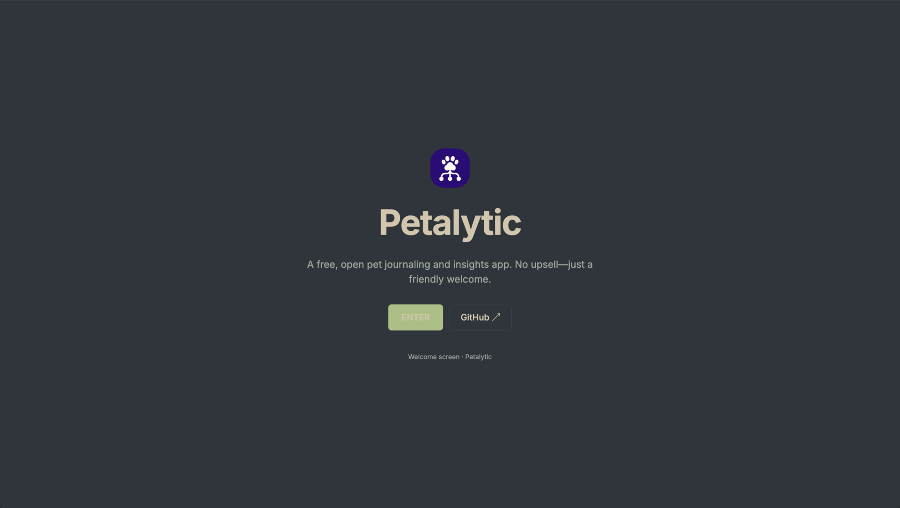

# 🐾 Petalytics

> Your intelligent pet journal powered by AI. Track, analyze, and understand your furry friend's well-being.

[](https://petalytics.vercel.app)
[](https://github.com/gitcoder89431/petalytics/actions/workflows/ci.yml)

## 🎥 Demo



## ▲ Deploy to Vercel

[](https://vercel.com/new/clone?repository-url=https%3A%2F%2Fgithub.com%2Fgitcoder89431%2Fpetalytics)

Notes:

- No server secrets needed; set your OpenRouter API key inside the app (Guardian panel).
- Default free model is enforced: `openai/gpt-oss-120b:free`.

## ✨ Features

- **🤖 AI-Powered Insights** - Get personalized care recommendations using OpenRouter API
- Ruixen agent orchestrator with built-in rate limiting and offline heuristics
- **📝 Smart Journaling** - Record daily activities, mood, and behavior patterns
- **🎨 Beautiful Themes** - 4 gorgeous themes (Everforest, Gruvbox Dark, Tokyo Night, Nord)
- **📊 Health Tracking** - Monitor wellness trends over time
- **🔒 Privacy First** - Your data stays local, export/import JSONL files
- **📱 Responsive Design** - Works on desktop, tablet, and mobile

## 🚀 Quick Start

### 1. Get an OpenRouter API Key

- Visit [OpenRouter.ai](https://openrouter.ai)
- Sign up and get your API key
- Copy the key (starts with `sk-or-`)

### 2. Use the App

- Visit [Petalytics](https://petalytics.vercel.app)
- Enter your API key in Guardian Settings
- Create your first pet profile
- Start journaling!

### 3. Local Development

```bash
git clone https://github.com/gitcoder89431/petalytics.git
cd petalytics
npm install
npm run dev
```

### Key Innovations

- **BYOK Model** - No backend costs, users own their data
- **Shell App Architecture** - Fully client-side with export/import
- **Breed-Specific AI** - Tailored insights based on pet characteristics
- **Beautiful 3-Panel Layout** - Inspired by modern desktop environments

### Tech Highlights

- SvelteKit + TypeScript for performance
- Direct browser → OpenRouter API integration
- Theme system extracted from omarchy-theme-builder
- JSONL data portability
- Zero database dependencies

## 📊 Usage

### 1. Guardian Setup (Top-Left Panel)

- Configure your profile and API key
- Choose from 4 beautiful themes
- Set preferences and reminders

### 2. Pet Management (Bottom-Left Panel)

- Create pet profiles with photos
- Add breed, age, and basic info
- Select active pet for journaling

### 3. Main Dashboard (Right Panel)

- View pet stats and recent activity
- Write new journal entries
- See AI analysis and recommendations
- Browse journal history

## 🤖 AI Features

The AI analyzes journal entries considering:

- **Breed-specific traits** (Golden Retriever vs Persian Cat)
- **Age-appropriate behavior** (puppy vs senior dog)
- **Historical patterns** (mood trends over time)
- **Health indicators** (activity level changes)

Sample AI insights:

- "Max seems more lethargic than usual for a young Golden Retriever"
- "Consider increasing mental stimulation based on recent boredom signs"
- "Schedule vet checkup - senior cats should be monitored closely"

## 🔐 Privacy & Data

- **Local First** - All data stored in browser localStorage
- **No Backend** - Direct API calls to OpenRouter
- **Export/Import** - Download JSONL backups anytime
- **BYOK** - Bring your own API key, control your costs

## 🎨 Themes

Four beautiful themes extracted from omarchy-theme-builder:

- **Everforest** - Comfortable green forest theme
- **Gruvbox Dark** - Warm, retro-inspired colors
- **Tokyo Night** - Modern dark with purple accents
- **Nord** - Cool arctic-inspired palette

## 📱 Responsive Design

- **Desktop** - Full 3-panel layout with optimal workflow
- **Tablet** - Adaptive layout with collapsible panels
- **Mobile** - Stacked panels for touch-friendly navigation

## 🛠️ Development

### Tech Stack

- **Frontend**: SvelteKit + TypeScript
- **Styling**: Tailwind CSS + Custom themes
- **AI**: OpenRouter API (Claude, GPT models)
- **Deployment**: Vercel
- **Data**: localStorage + JSONL export/import

### Scripts

```bash
npm run dev          # Development server
npm run build        # Production build
npm run test         # Run tests
npm run lint         # Code linting
npm run check        # Type checking
```

### Architecture

```text
┌─────────────────┬─────────────────┐
│ Guardian Panel  │                 │
├─────────────────┤   Main Viewport │
│ Pet Panel       │   (Dashboard,   │
│                 │   Journal,      │
│                 │   History)      │
└─────────────────┴─────────────────┘
```

## 🏆 Contest Highlights

1. **Innovation**: BYOK model eliminates backend complexity
2. **Design**: Beautiful theme system with smooth transitions
3. **Performance**: Lightning-fast SvelteKit implementation
4. **Privacy**: User owns their data completely
5. **AI Integration**: Smart breed-specific insights
6. **Accessibility**: Full keyboard navigation support
7. **Mobile Ready**: Responsive across all devices

## 📄 License

MIT License - see [LICENSE](LICENSE) for details.

## 🙏 Acknowledgments

- OpenRouter for providing accessible AI APIs
- Omarchy theme system for beautiful color palettes
- SvelteKit team for an amazing framework
- Contest organizers for the opportunity

---

Made with ❤️ for pets and their humans.
